# 零.部属信息

本项目部署的服务器是<腾讯云轻量应用服务器>,新用户有优惠

[腾讯云轻量服务器](https://cloud.tencent.com/act/cps/redirect?redirect=1079&cps_key=c451b537a56f18f524f58aa0c85793c8&from=console)

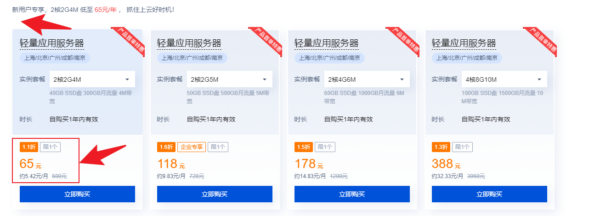

### 一、瑞吉外卖Docker容器部属,单容器部属

> **在线访问:*
>
> 前台:
>
> http://love7o.com:8084/front/page/login.html
>
> 后台:
>
> http://love7o.com:8084/backend/index.html

#### **访问该项目**

###### 访问该项目前端

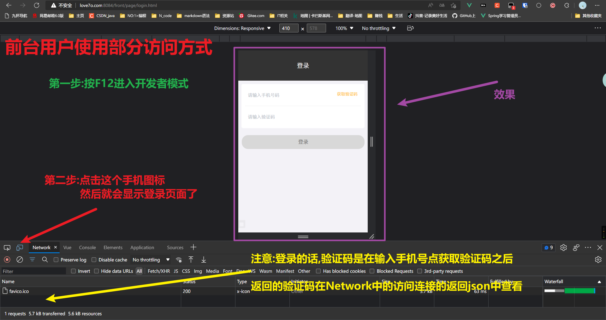

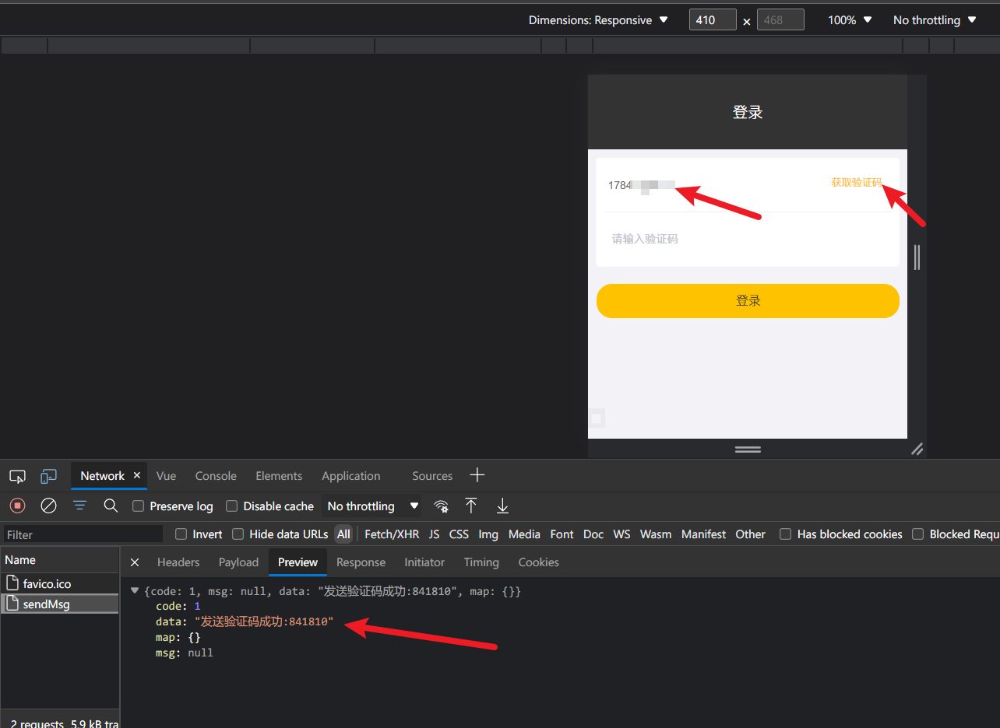

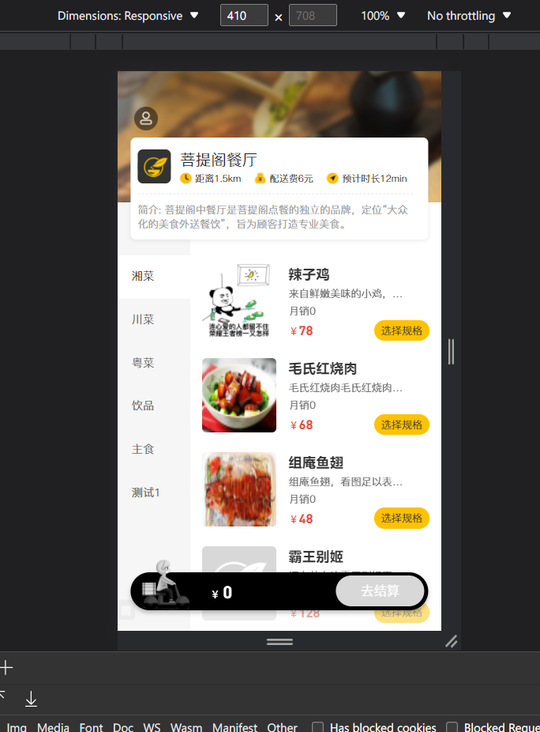

###### 访问该项目后台

直接输入地址就可以访问了

> Docker部属前置条件,redis,mysql,docker

#### 1.部属mysql数据库

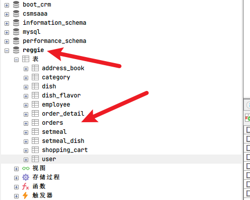

#### 2部属redis


#### 3修改项目的配置文件,配置redis的数据库信息和mysql的数据库信息

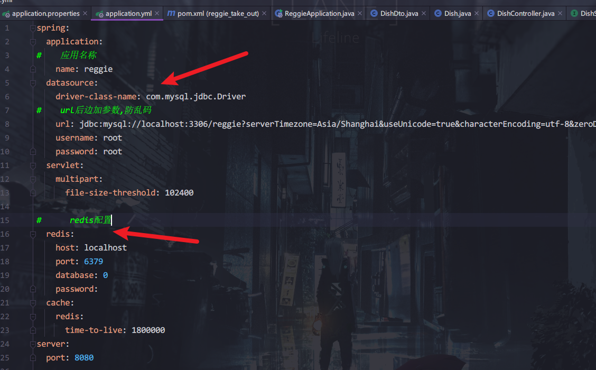

#### 4项目打包

##### 4.1.将项目打包进行本地测试

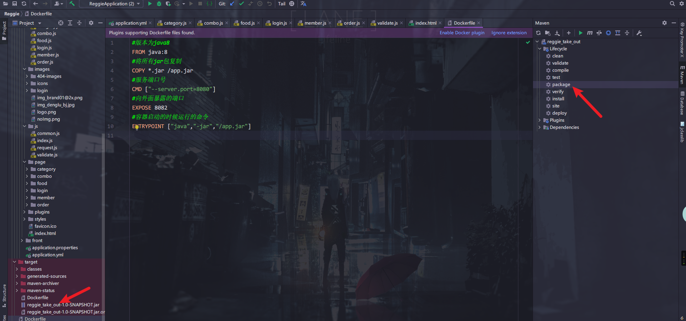

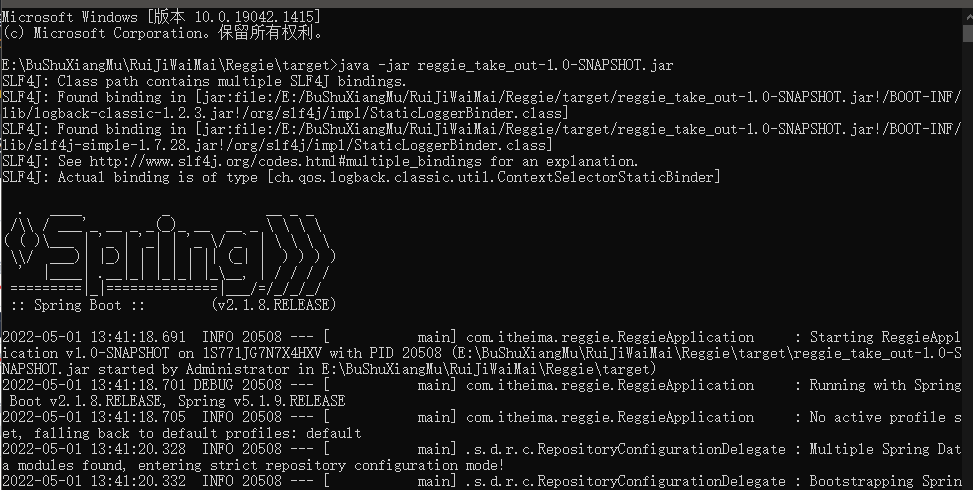

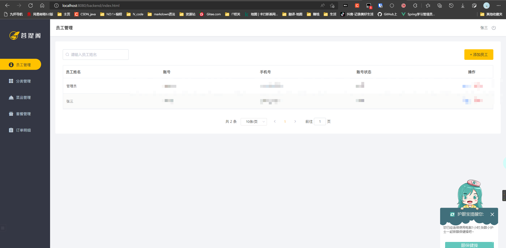

##### 4.2.编写Dockerfile文件

```dockerfile
#版本为java8
FROM java:8
#将所有jar包复制
COPY *.jar /app.jar
#服务端口号
CMD ["--server.port=8080"]
#向外面暴露的端口
EXPOSE 8080
#容器启动的时候运行的命令
#ENTRYPOINT ["java","-jar","/app.jar"]
# 下面是限制内存的启动
ENTRYPOINT ["java","-jar","-Xms128m","-Xmx300m","/app.jar"]
```

#### 5.将dockerfile和项目打包的文件上传到服务器

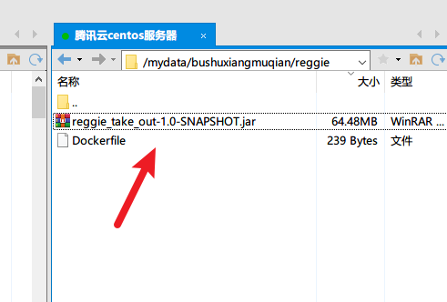

#### 6.用项目创建一个镜像

```
制作镜像命令
docker build -t reggit .
```

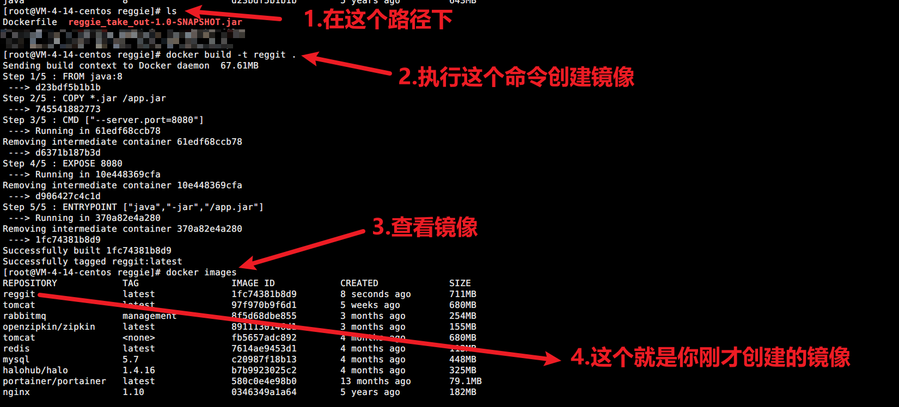

#### 7.用刚才创建的镜像制作一个容器

```sh
#提前在linux中创建好如下这两个目录
/mylog/reggie
/mydata/img/reggie

#创建镜像命令 在命令行中运行
docker run  -p 8084:8080 --name reggitv2  \
-v /mylog/reggie:/mylog/reggie \
-v /mydata/img/reggie:/mydata/img/ \
-d reggit


查看已启动的容器命令
docker ps
```

> 创建镜像命令详解
> docker run  -p 8084:8080   \ #端口,外部端口:内部端口
>
> --name reggitv1  \  #服务名
> -v /mylog/reggie:/mylog/reggie \ #日志数据卷 外部路径:内部路径
> -v /mydata/img/reggie:/mydata/img/reggie \ #图片数据卷 外部路径:内部路径
> -d reggit #要使用的镜像

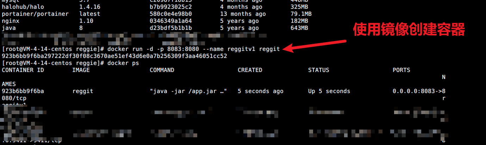

#### 8.进入容器,查看日志

```
#进入创建的容器命令
docker exec -it 923b6 /bin/bash


#在docker容器中查看日志
#这两个命令都可以查看日志
cat logs.log
tail logs.log

#也可以在linux主机中查看,具体的命令和上边一样,就是路径不一样
```

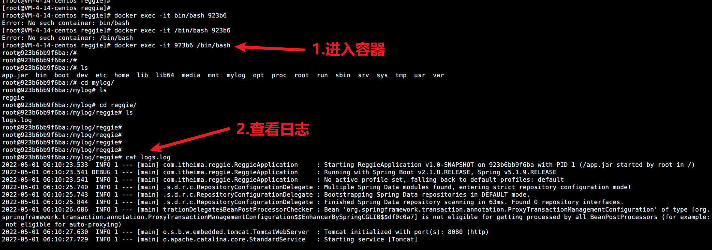


#### 注意:

```sh
docker删除镜像image
docker rmi ee7cbd482336

docker删除容器
docker rm reggi...s
```

#### 参考

###### 使用docker部署springboot项目小白教程

https://blog.csdn.net/zhenghuishengq/article/details/112987162

### 二.在linux实体主机上部属该项目==>没有前后端分离

#### 1.检查linux上是否有java环境

```
java -version

java -jar 

```

##### 如下说明有java环境

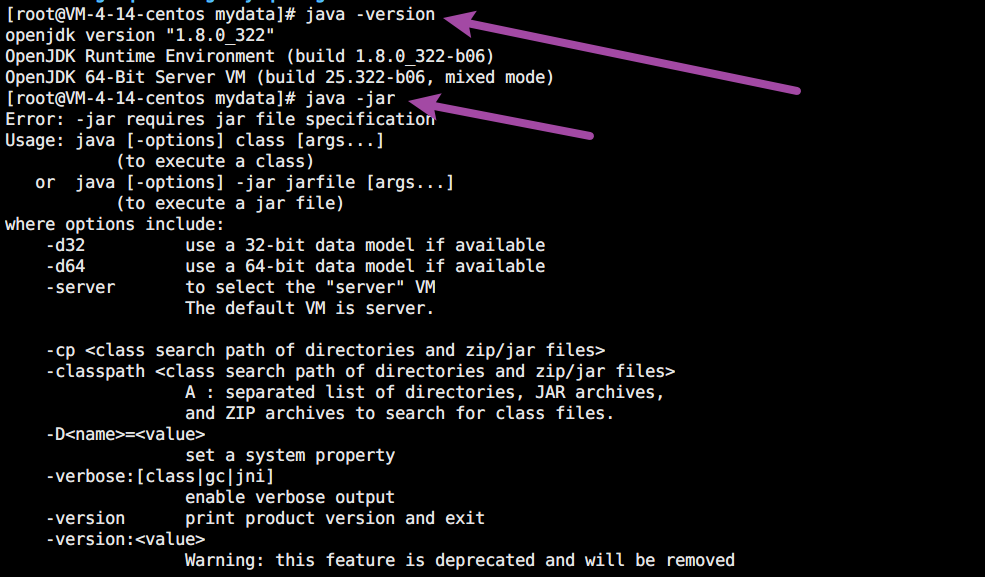

##### 如果没有参考如下进行安装

https://blog.csdn.net/Swing_yue/article/details/121194673

#### 2.mysql,redis之类可以自己安装,也可以使用docker中的


#### 3.将你的项目在idea中编译打包,上传到linux中

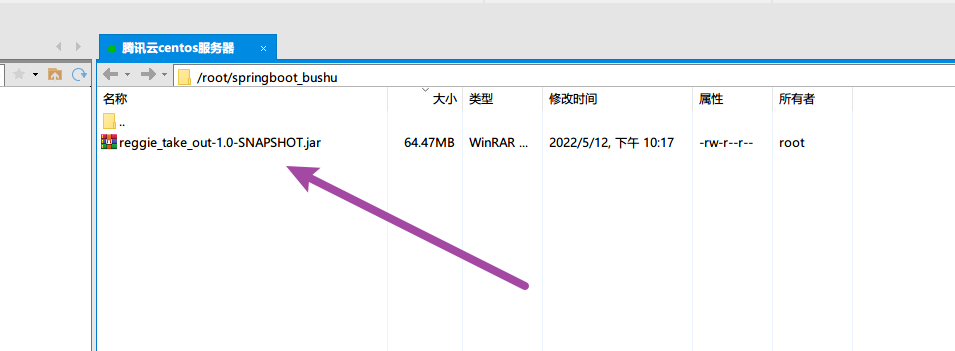

#### 4.运行这个jar包就可以启动项目

```
指定端口8079运行这个jar包

java -jar reggie_take_out-1.0-SNAPSHOT.jar --server.port=8079

```

##### 运行效果

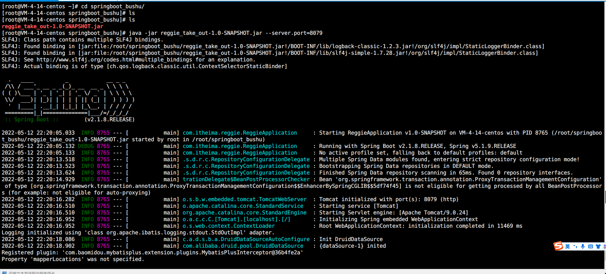

#### 5.使用postman测试==>注意要在防火墙放开端口8079

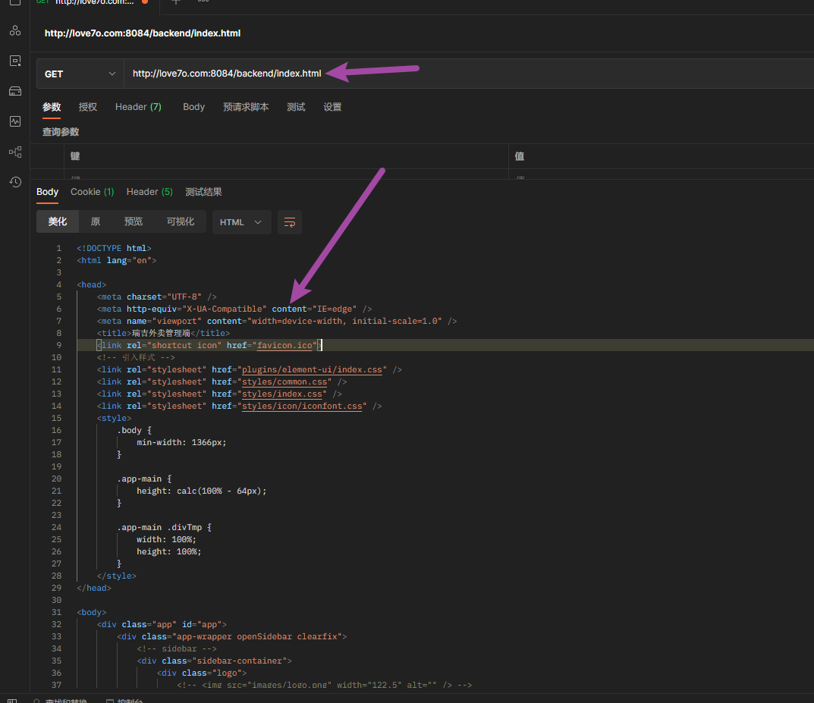


#### 6.访问测试

http://love7o.com:8084/backend/index.html

http://love7o.com:8084/front/page/login.html

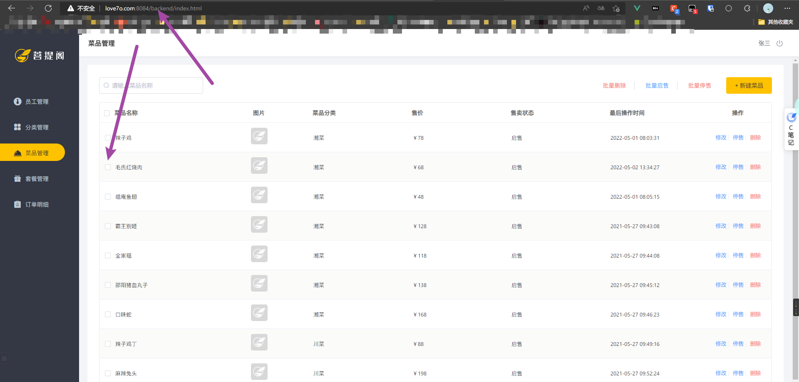

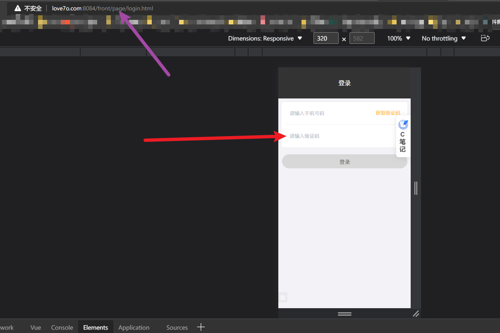

# 一.项目介绍信息

### 一、项目介绍

本项目（瑞吉外卖）是专门为餐饮企业（餐厅、饭店）定制的一款软件产品，包括系统管理后台和移动端应用两部分。其中系统管理后台主要提供给餐饮企业内部员工使用，可以对餐厅的分类、菜品、套餐、订单、员工等进行管理维护。移动端应用主要提供给消费者使用，可以在线浏览菜品、添加购物车、下单等。

**你自己本机部属的地址**

- 后台管理：http://localhost:8080/backend/index.html
- 前端页面：http://localhost:8080/front/index.html


#### 1、管理端

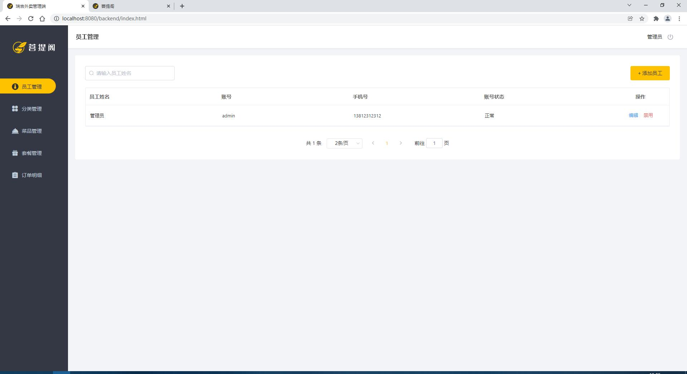

餐饮企业内部员工使用。 主要功能有:

| 模块      | 描述                                                         |
| --------- | ------------------------------------------------------------ |
| 登录/退出 | 内部员工必须登录后,才可以访问系统管理后台                    |
| 员工管理  | 管理员可以在系统后台对员工信息进行管理，包含查询、新增、编辑、禁用等功能 |
| 分类管理  | 主要对当前餐厅经营的 菜品分类 或 套餐分类 进行管理维护， 包含查询、新增、修改、删除等功能 |
| 菜品管理  | 主要维护各个分类下的菜品信息，包含查询、新增、修改、删除、启售、停售等功能 |
| 套餐管理  | 主要维护当前餐厅中的套餐信息，包含查询、新增、修改、删除、启售、停售等功能 |
| 订单明细  | 主要维护用户在移动端下的订单信息，包含查询、取消、派送、完成，以及订单报表下载等功能 |

#### 2、用户端

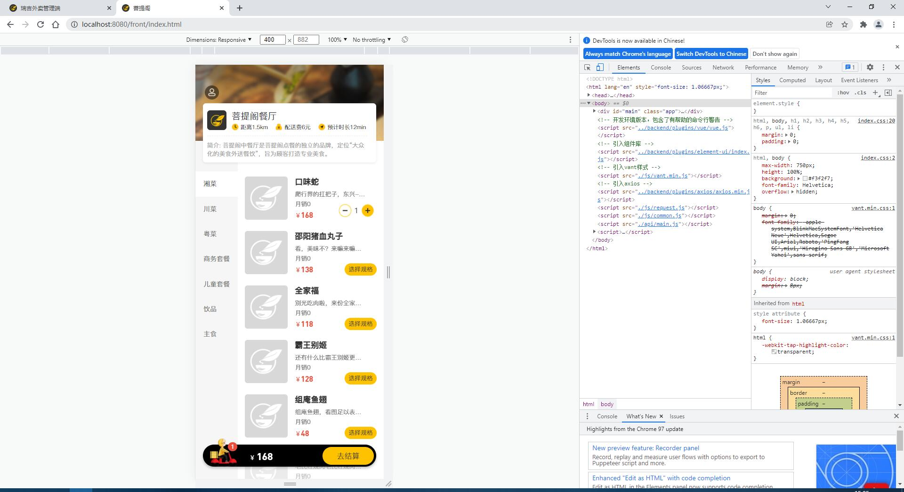

移动端应用主要提供给消费者使用。主要功能有:

| 模块        | 描述                                                         |
| ----------- | ------------------------------------------------------------ |
| 登录/退出   | 在移动端, 用户也需要登录后使用APP进行点餐                    |
| 点餐-菜单   | 在点餐界面需要展示出菜品分类/套餐分类, 并根据当前选择的分类加载其中的菜品信息, 供用户查询选择 |
| 点餐-购物车 | 用户选中的菜品就会加入用户的购物车, 主要包含 查询购物车、加入购物车、删除购物车、清空购物车等功能 |
| 订单支付    | 用户选完菜品/套餐后, 可以对购物车菜品进行结算支付, 这时就需要进行订单的支付 |
| 个人信息    | 在个人中心页面中会展示当前用户的基本信息, 用户可以管理收货地址, 也可以查询历史订单数据 |

### 二、技术选型

关于本项目的技术选型, 我们将会从 用户层、网关层、应用层、数据层 这几个方面进行介绍，而对于我们服务端开发工程师来说，在项目开发过程中，我们主要关注应用层及数据层技术的应用。


#### 1、用户层

本项目中在构建系统管理后台的前端页面，我们会用到H5、Vue.js、ElementUI等技术。而在构建移动端应用时，我们会使用到微信小程序。

#### 2、网关层

Nginx是一个服务器，主要用来作为Http服务器，部署静态资源，访问性能高。在Nginx中还有两个比较重要的作用： 反向代理和负载均衡， 在进行项目部署时，要实现Tomcat的负载均衡，就可以通过Nginx来实现。

#### 3、应用层

SpringBoot： 快速构建Spring项目, 采用 "约定优于配置" 的思想, 简化Spring项目的配置开发。

Spring: 统一管理项目中的各种资源(bean), 在web开发的各层中都会用到。

SpringMVC：SpringMVC是spring框架的一个模块，springmvc和spring无需通过中间整合层进行整合，可以无缝集成。

SpringSession: 主要解决在集群环境下的Session共享问题。

lombok：能以简单的注解形式来简化java代码，提高开发人员的开发效率。例如开发中经常需要写的javabean，都需要花时间去添加相应的getter/setter，也许还要去写构造器、equals等方法。

Swagger： 可以自动的帮助开发人员生成接口文档，并对接口进行测试。

#### 4、数据层

MySQL： 关系型数据库, 本项目的核心业务数据都会采用MySQL进行存储。

MybatisPlus： 本项目持久层将会使用MybatisPlus来简化开发, 基本的单表增删改查直接调用框架提供的方法即可。

Redis： 基于key-value格式存储的内存数据库, 访问速度快, 经常使用它做缓存(降低数据库访问压力, 提供访问效率), 在后面的性能优化中会使用。

#### 5、工具

git: 版本控制工具, 在团队协作中, 使用该工具对项目中的代码进行管理。

maven: 项目构建工具。

junit：单元测试工具，开发人员功能实现完毕后，需要通过junit对功能进行单元测试。

### 三、功能架构

 

#### 1、移动端前台功能

手机号登录 , 微信登录 , 收件人地址管理 , 用户历史订单查询 , 菜品规格查询 , 购物车功能 , 下单 , 分类及菜品浏览。

#### 2、系统管理后台功能

员工登录/退出 , 员工信息管理 , 分类管理 , 菜品管理 , 套餐管理 , 菜品口味管理 , 订单管理 。

### 四、用户角色

在瑞吉外卖这个项目中，存在以下三种用户，这三种用户对应三个角色： 后台系统管理员、后台系统普通员工、C端(移动端)用户。

| 角色             | 权限操作                                                     |
| ---------------- | ------------------------------------------------------------ |
| 后台系统管理员   | 登录后台管理系统，拥有后台系统中的所有操作权限               |
| 后台系统普通员工 | 登录后台管理系统，对菜品、套餐、订单等进行管理 (不包含员工管理) |
| C端用户          | 登录移动端应用，可以浏览菜品、添加购物车、设置地址、在线下单等 |

