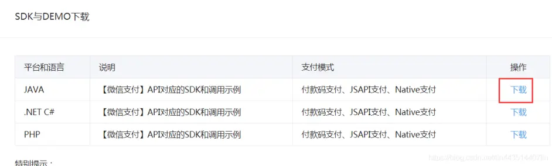
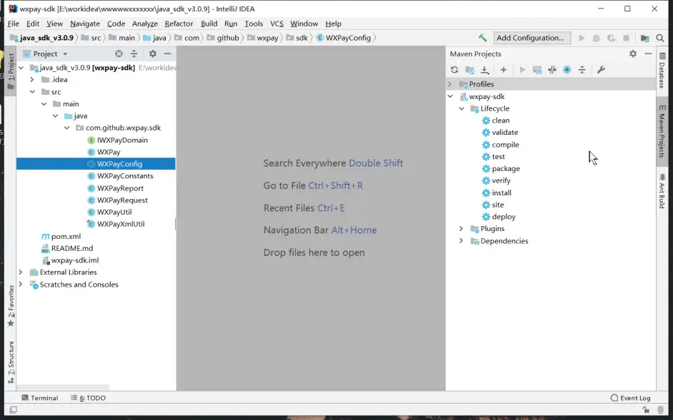
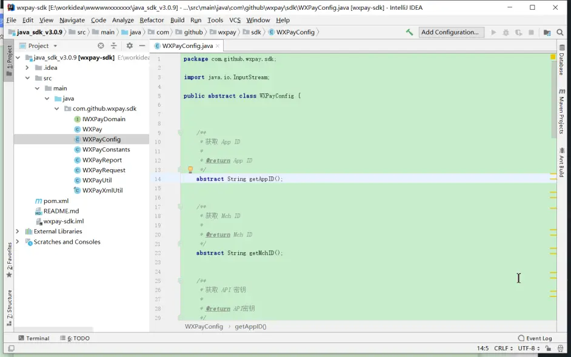
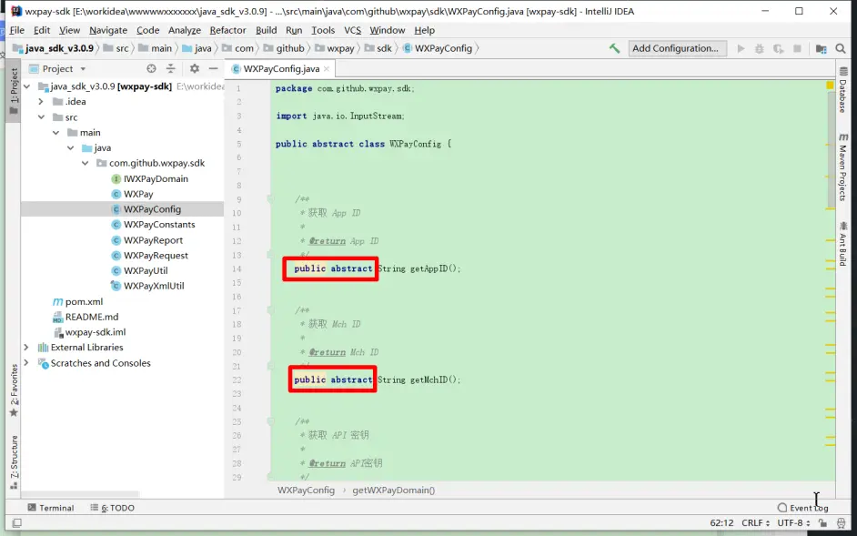
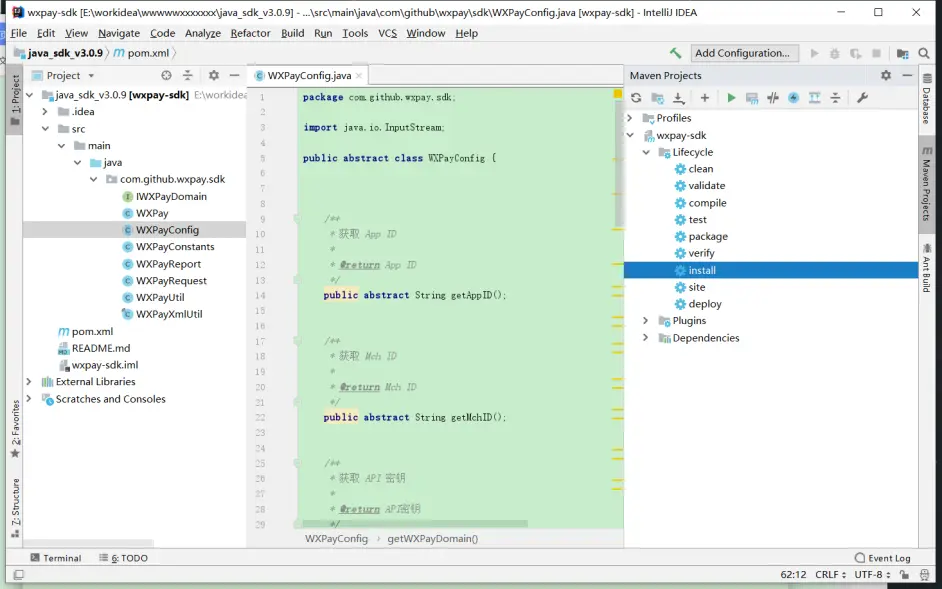
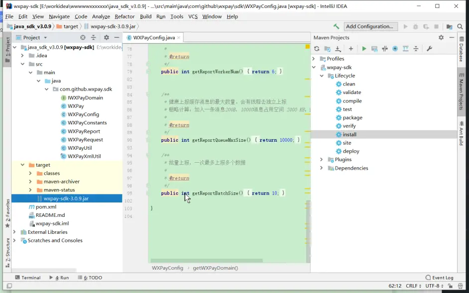
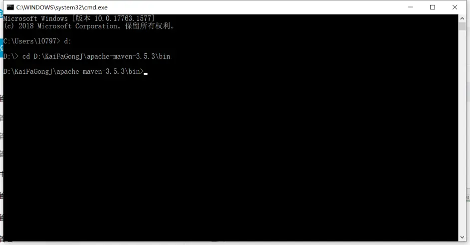
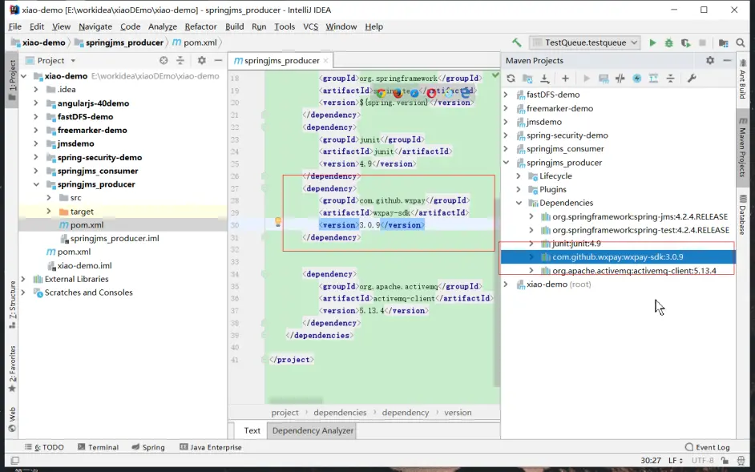

# 微信支付SDK wx-sdk 打包安装到本地maven仓库 - 哔哩哔哩

> ## Excerpt
> 官方SDK为3.0.9版本同样也是基于maven构建，只不过没有上传到maven的公共仓库，那么我们就可以自己动手打成jar包从而导入本地maven项目。1 下载官方sdk项目官方 https://pay.weixin.qq.com/wiki/doc/api/jsapi.php?chapter=11_12 导入idea3 给WXPayConfig.java 中抽象方法加上public修饰符4 进行 mav install ，在target 目录下找到wxpay-sdk-**.jar5 进入cmd

---
官方SDK为3.0.9版本同样也是基于maven构建，只不过没有上传到maven的公共仓库，那么我们就可以自己动手打成jar包从而导入本地maven项目。

1 下载官方sdk项目

官方 https://pay.weixin.qq.com/wiki/doc/api/jsapi.php?chapter=11\_1

2 导入idea

3 给WXPayConfig.java 中抽象方法加上public修饰符

4 进行 mav install ，在target 目录下找到wxpay-sdk-\*\*.jar

5 进入cmd 

6 运行7的 mvn install:install-file -Dfile=D:\\wxpay-sdk-3.0.9.jar -DgroupId=com.github.wxpay \-DartifactId=wxpay-sdk -Dversion=3.0.9 -Dpackaging=jar 命令。

7 安装本地jar包到本地仓库需要如下命令(注意不要换行):   

mvn install:install-file -Dfile=D:\\wxpay-sdk-3.0.9.jar -DgroupId=com.github.wxpay \-DartifactId=wxpay-sdk -Dversion=3.0.9 -Dpackaging=jar

参数说明

mvn install:install-file -Dfile=<path-to-file> -DgroupId=<group-id> -DartifactId=<artifact-id> -Dversion=<version> -Dpackaging=<packaging> 

<path-to-file>: 要安装的JAR的本地路径

<group-id>：要安装的JAR的Group Id

<artifact-id>: 要安装的JAR的 Artificial Id

<version>: JAR 版本 <packaging>: 打包类型，例如JAR

8  maven的pom.xml引入wxpay-sdk依赖。

 <dependency>

            <groupId>com.github.wxpay</groupId>

            <artifactId>wxpay-sdk</artifactId>

            <version>3.0.9</version>

        </dependency>

